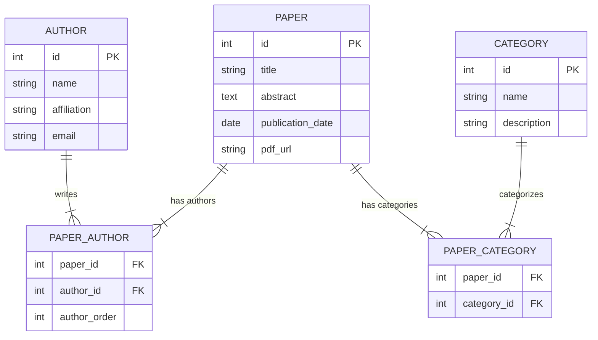

# AcaRadar 
Application that allows researchers to find innovative research topics from other domains. 


## Overview
AcaRadar will pull data from arXiv's API using **query** entity, to fetch **paper** entity, which include **authors**, **categories** and **links**.

It will then preprocess the text data and transform them into embeddings using pre-trained scientific language models. 

Finally, it will cluster the embeddings to identify research topics and visualize them in a word cloud showing 
1. The most frequent terms in selected domains
2. Intersections between different domains 

We hope this tool will give researchers a quick overview of research trends in their own and other domains, and inspire them to explore innovative research topics.

## Objectives
### Short-term usability goals
1. Preprocess text data and generate embeddings
2. Define n-gram frequency algo for word cloud 
3. Define clustering algo to define the distance between each n-gram 
4. Define intersection between different domains

### Long-term goals
1. Speed up the embedding generation process


### Setup

- Copy `config/secrets_example.yml` to `config/secrets.yml` 
- Ensure correct version of Ruby install (see .`ruby-version` for `rbenv`)
- Run `bundle install`

## Running tests
### To run tests:
```bash
rake spec
```

### To test code quality:
```bash
rake quality:all
```

### To run the app:
```bash
rake run
```

### To run migration:
```bash
RACK_ENV=development rake db:migrate
RACK_ENV=test rake db:migrate
```

### To test orm:
```bash
rake console 
# pry(main)> AcaRadar::Database::PaperOrm.all
```

### To delete the database:
```bash
RACK_ENV=development rake db:drop
RACK_ENV=test rake db:drop
```

## Entity Relationship Diagram 
[Editable version](https://mermaid.live/edit#pako:eNqlVF1vmzAU_SuW90oiAoEE-hRl7SZVXaOm07QJKXKxAWtgI2PUpAn_fddAvpRkmjS_WD7n3E9fe4tjSRkOMVOfOUkVKSKBYM2-v359fkHb7mQWFxpxihaPR6jSiosUCVKwC5AkCc850VyKC44VhOcd2nTbfPZ6_-X55ed_BKSsihUvjwF714vZ4v4fC9Fc5yeONVtrRN6AJLE-wpRohsr6LedxW97KABe-SpqsapVfprK63tqSlEytIK-Hx3OC1DqTf2OkokxdiXOrpzcjQTkslWpzyp01cbcbDHbb8zJCFOGMVH0yVYTP5ueWxbvimh3EV7wfkt_775PjR6uD5Lbh3ujDWGELF0zB6FEY97YnEdYZg1HCRitYDRedR9jqqIILWpDSkH0DI1wSSuFyDebY1h6tK_ZE1j841ZlhtKrbcWh6R4kU-oEUPN90geayhjIU-sbeD8GMZglpGsXIt06Smy-XndlQwENFMVdxztAWwevKQ_QpSTxYd6hBHa9YrI-s5xn-zsyk_M1auVmtnNGULYjOQH1Bd8Dg3ZQEpZZrsDBtb6CHcNFyuRExDk2hFlayTjMcJiSv4FSX5jX0X8leUhLxS8rDkVGupXrq_p32-7Fwqsy19B6ZgImGNgmNw5HT2uNwi9dwmoyHvj0NJr4zDeyJ64wtvAHYngwnrmuPR4E_Daa24zcW_mhD2kPfc1zPm7i257peEATNHww3feg)

